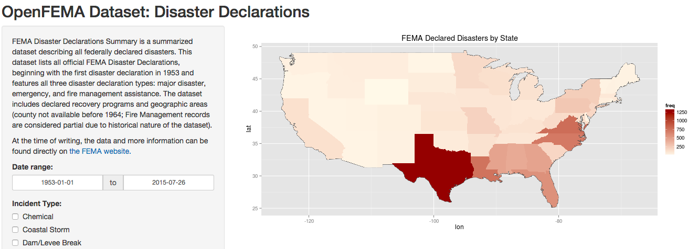

## Humans + Technology

As we become more and more dependent as a species on the technologies and infrastructure around us, it is especially critical to note the trends in the destructive forces that could bring these systems down.

While this dependence on technology could be seen as a crutch, it can also empower us to prepare ourselves for what's to come.

## Data Science To The Rescue!

Data science is one of these tools. By taking massive data sets and organizing them in an intuitive, interactive, and quick-to-grasp reports and visualizations we can better use the information that we already have, and determine what more we might need.

---

## An Example: Disasters

One example is the [FEMA Disaster Declarations data set](https://www.fema.gov/openfema-dataset-disaster-declarations-summaries-v1) that has been collected in the United States, documenting all declared disasters since 1953. For instance, we can generate a static chart (using only 2 lines of R!) and gain some insights:


```r
data <- read.csv("data/DisasterDeclarationsSummaries.csv")
barplot(table(data$incidentType), main="Disaster Frequency by Type", las=2, cex.names=0.5)
```

 

Through examining this static chart, we can see that Fire Storms, Floods, and Hurricanes are the top types of disasters we have seen and might want to look into preparing for going forward.

---

## One Step Further: Dynamic Applications

If the leap from a collection of data to some clear insights from a static chart is great, the addition of independent and natural interaction with the data is phenomenal.

We can [take a look here](https://grasser.shinyapps.io/fema-disasters) at an application that adds the ability to map the data we explored in the last slide to a physical place and a time range as well.  As we add layers like this, we have the potential for more insights and breakthroughs, which could well lead to better efficiency in preparing, and even saved lives!

[](https://grasser.shinyapps.io/fema-disasters)

--- &radio

## A Quiz

Visit [the interactive FEMA historical disaster map referenced on the previous slide](https://grasser.shinyapps.io/fema-disasters) in order to answer the following:

Which state had the most Fire-related disaster incidents between Jan 1, 1984 and today?

1. California
2. _Texas_
3. Florida

*** .hint

Make sure you set the date parameters and filters correctly in the application!

*** .explanation

Correct! Texas had the most (900+) Fire incidents since January 1, 1984. We can find this answer by setting the date range in the application, unchecking all Incident boxes other than "Fire," which we make sure stays checked. By examining the resulting map, we can clearly see that Texas stands out as bright red indicating the highest incidence.


